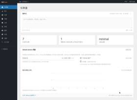

  

<h1 align="center">tap6</h1>

  对世界抱有敬意。 
  浙江 · <a href="https://uxn.cc">uxn.cc</a> · <a href="https://github.com/trustdev-org">TrustDev</a>

做的东西大多让数据留在自己手里：文章在自己的仓库，日记在本机，域名自己看着，聊天可以架在自己的机器上。

## 日历日记

[Calendar Diary](https://github.com/trustdev-org/calendar-diary) 是跨平台的桌面日历，用来记待办、计划和心情。数据在本机，也可以用自己的 WebDAV 同步。下载在 [diary.trustdev.org](https://diary.trustdev.org)。

## GitPress

[GitPress](https://gitpress.net) 是博客后台。写法接近 WordPress，文章存在你自己的 GitHub 仓库，发布后编成静态网页。后台、主题和编译器分别在 [GitPress.net](https://github.com/tap6/GitPress.net)、[gitpress](https://github.com/tap6/gitpress)、[build-action](https://github.com/tap6/build-action)。我的博客 [uxn.cc](https://uxn.cc) 就是用它写的。

## 域名管家

[DomainMaster](https://github.com/trustdev-org/domain-master) 用来看着一批域名：导入名单，查 Whois，标出快过期和正在抢注的。在线版是 [dm.trustdev.org](https://dm.trustdev.org)。

## WhisperLink

[WhisperLink](https://github.com/trustdev-org/WhisperLink) 是自己部署的加密聊天。填一个昵称和一段频道码就能进房间，消息在浏览器里加密后再发出。

## AnomyChat

[AnomyChat](https://github.com/trustdev-org/AnomyChat) 是更轻的匿名聊天室，部署到 Vercel 就能开一个临时房间。
